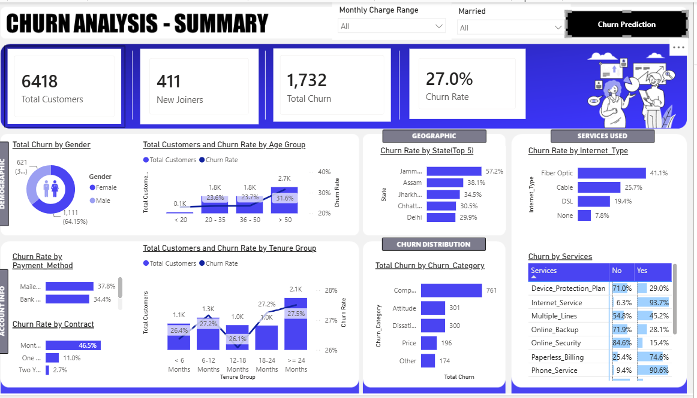
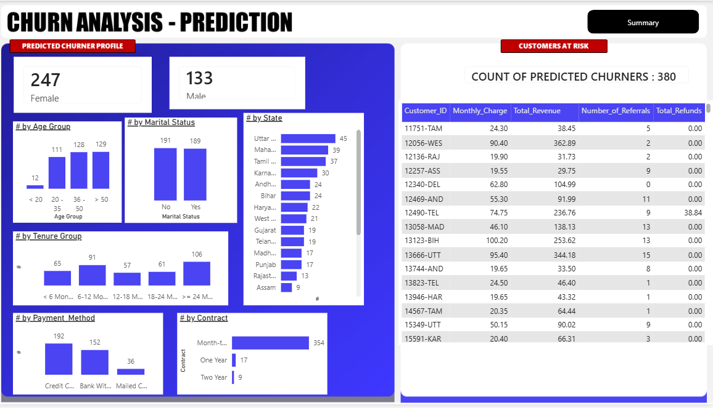

# 📊 Telecom Customer Churn Analysis

> **End-to-End Customer Churn Analytics using SQL Server, Power BI, and Machine Learning**

## 📌 Project Overview

Developed an end-to-end customer churn analytics solution using the **Telco Customer Churn** dataset from Kaggle. The project combines **SQL Server** for data preparation, **Power BI** for interactive dashboards, and **Python (Random Forest)** to predict customers likely to churn, enabling data-driven retention strategies.

---

## 🎯 Business Problem

Telecom companies lose revenue due to customer churn. This project identifies churn patterns, analyzes customer behavior, and predicts high-risk customers to support proactive retention efforts.

---

## 📂 Dataset

* **Source:** Kaggle – Telco Customer Churn Dataset
* **Records:** 7,043 Customers
* **Target Variable:** Customer Status (Stayed / Churned)

---

## 🛠 Tech Stack

* SQL Server
* Power BI
* Python
* Pandas
* NumPy
* Scikit-learn
* Matplotlib

---

## 🔄 Project Workflow

```text
Kaggle Dataset
      ↓
SQL Data Exploration & Cleaning
      ↓
Production Tables & SQL Views
      ↓
Power BI Dashboard
      ↓
Random Forest Model
      ↓
Customer Churn Prediction
```

---

## 📈 Dashboard

### Churn Analysis Dashboard

* Total Customers, Churn Rate & New Joiners
* Customer Demographics
* Contract & Payment Analysis
* Geographic Analysis
* Service Usage Analysis
* Churn Category Distribution
  



---

### Churn Prediction Dashboard

Displays customers predicted to churn using the Random Forest model, along with demographic and contract insights to support targeted retention campaigns.




---

## 🤖 Machine Learning

Built a **Random Forest Classifier** to predict customer churn.

**Model Pipeline**

* Data Preprocessing
* Label Encoding
* Train-Test Split
* Random Forest Training
* Model Evaluation
* Feature Importance
* Prediction for New Customers

---

## 💡 Key Insights

* Overall churn rate: **27%**
* **1,732** customers churned
* Month-to-Month contracts have the highest churn (**46.5%**)
* Fiber Optic customers show higher churn
* Customers without Online Security or Device Protection are more likely to churn
* Model identified **380** newly joined customers as high-risk churners

---

## 📁 Repository Structure

```text
telecom-customer-churn-analysis
│
├── sql/
├── notebooks/
├── powerbi/
├── images/
├── README.md
└── requirements.txt
```

---

## 🚀 How to Run

1. Execute the SQL scripts in SQL Server.
2. Open the `.pbix` file using Power BI Desktop.
3. Install dependencies using `requirements.txt`.
4. Run the Jupyter Notebook to train the model and generate predictions.
